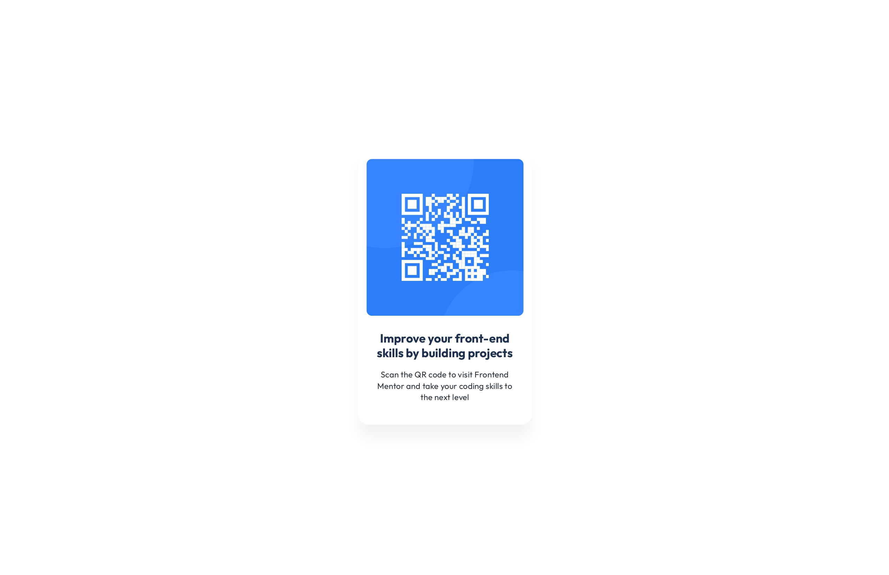

# QR code component
---

## 📌 Overview  
A simple and responsive **QR Code Card UI** built using **HTML & CSS**.  
This project is my **first front-end practice project**, focused on layout, typography, and clean code structure. 

**The page includes:** 
- ✅ Clean and minimal UI
- ✅ Fully responsive card layout
- ✅ Centered using Flexbox
- ✅ Custom font & spacing
- ✅ Beginner-friendly code

### Screenshot 📱
  

### Links 🔗
- Live Demo: [View Project](qr-code-component-fmio.netlify.app)  
- Source Code: [GitHub Repository](https://github.com/sameer-srb/QR_Code_Component)

---

## 🚀 My process

### Built with

-   
- 
- 

### What I learned 📑
During this project, I strengthened my skills in:
- ✔️ Structuring HTML using semantic elements
- ✔️ Centering elements with Flexbox
- ✔️ Using `box-shadow` and `border-radius`
- ✔️ Working with external fonts
- ✔️ Writing clean, readable CSS

### Useful resources 📚 
- [MDN Web Docs – HTML](https://developer.mozilla.org/en-US/docs/Web/HTML)  
- [MDN Web Docs – CSS](https://developer.mozilla.org/en-US/docs/Web/CSS) 
- [Frontend Mentor](https://www.frontendmentor.io/challenges/qr-code-component-iux_sIO_H)  
- [Google Fonts (Outfit)](https://fonts.google.com/specimen/Outfit)

---
## 🙏 Acknowledgments
Special thanks to **frontendmentor.io** and **MDN Docs** for helpful resources during the development.
Also thanks to -
- log2base2.com
- freecodecamp.org

---

## 📬 Feedback
Suggestions or improvements welcome!  
Feel free to open an issue or reach out.

**Author :-**

 -  - 

Created by **SAMEER** - 2026

